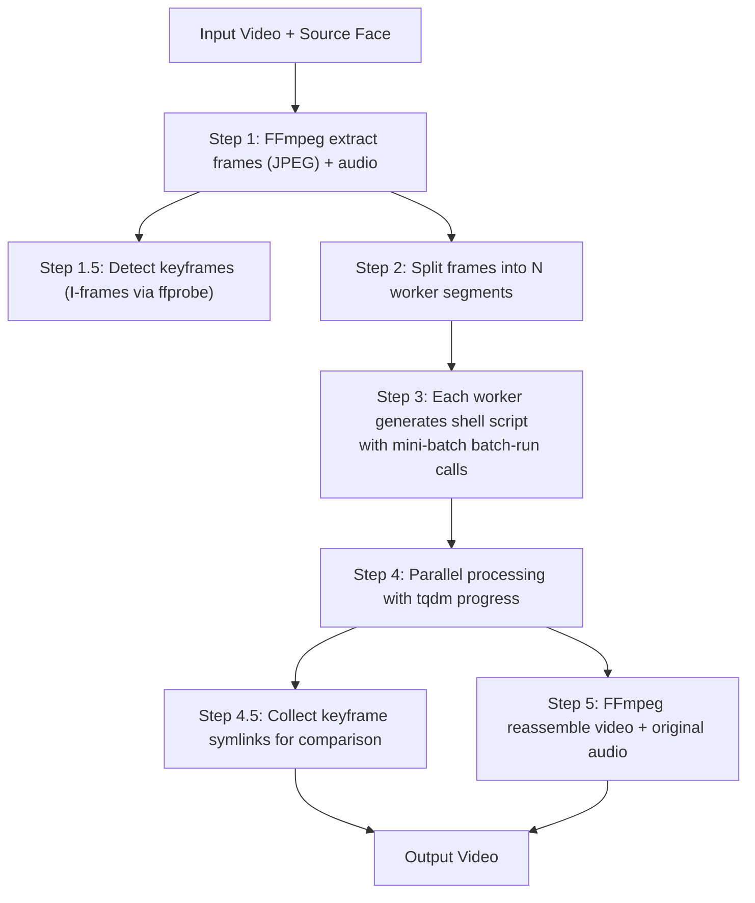

# Video Face-Swap Pipeline Guide

## Quick Start

```bash
python video_face_swap.py \
    --video input.mp4 \
    --source face.jpg \
    --output result.mp4 \
    --workers 3
```

Process a time range only:

```bash
python video_face_swap.py \
    --video input.mp4 --source face.jpg \
    --start-time 00:01:00 --end-time 00:02:30 \
    --workers 4
```

## Pipeline Overview



## Why This Script Exists

FaceFusion cannot detect faces in certain video encodings. This script works around it by:

1. Extracting frames as JPEG images (bypasses video codec issues, much smaller than PNG)
2. Running FaceFusion `batch-run` on the extracted frames
3. Reassembling the processed frames back into video

## Architecture: batch-run with Mini-Batches

Each worker splits its frames into **mini-batches** (default 50 frames). Each mini-batch is one `batch-run` invocation:

```bash
python facefusion.py batch-run \
    --processors face_swapper \
    --config-path facefusion.ini \
    --jobs-path /path/to/jobs \
    -s source_face.jpg \
    -t "/path/to/mini_batch/*.jpg" \
    -o "/path/to/output/{target_name}{target_extension}"
```

This design balances two concerns:
- **Large single batch**: Model loads once, but O(n²) JSON overhead grows quadratically
- **Per-frame headless-run**: No JSON overhead, but model reloads every frame (~100x slower)
- **Mini-batch (chosen)**: Model loads once per batch of 50 frames, JSON overhead stays small

## CLI Arguments

| Argument | Default | Description |
|---|---|---|
| `--video` | required | Input video file path |
| `--source` | required | Source face image path |
| `--output` | auto | Output video path (default: inside work dir) |
| `--workers` | 2 | Number of parallel FaceFusion processes |
| `--batch-size` | 50 | Frames per mini-batch inside each worker |
| `--start-time` | None | Start time (HH:MM:SS or seconds) |
| `--end-time` | None | End time (HH:MM:SS or seconds) |
| `--work-base` | `.` | Parent directory for the work folder |
| `--config-path` | `facefusion.ini` | Path to FaceFusion config file |
| `--frame-quality` | 95 | JPEG quality for extracted frames (80-100) |
| `--video-encoder` | `libx264` | Video encoder: `libx264`, `mpeg4`, `h264_nvenc` |
| `--video-crf` | 23 | CRF quality for libx264 (18-28, lower = better) |
| `--video-preset` | `medium` | Encoding speed preset for libx264 |

## Configuration (facefusion.ini)

Key settings that affect face swapping:

```ini
[frame_extraction]
temp_frame_format = jpeg

[output_creation]
output_video_encoder = libx264
output_video_preset = medium
output_video_quality = 80

[processors]
processors = face_swapper
face_swapper_model = hyperswap_1a_256
face_swapper_weight = 0.5
face_swapper_pixel_boost = 256x256

[execution]
execution_providers = cuda
execution_thread_count = 2
```

| Setting | Description | Options |
|---|---|---|
| `temp_frame_format` | Frame extraction format | `jpeg` (recommended, ~90% smaller), `png` |
| `output_video_encoder` | Video encoding codec | `libx264` (recommended), `mpeg4`, `h264_nvenc` |
| `output_video_preset` | Encoding speed preset | `ultrafast` → `veryslow` (default: `medium`) |
| `output_video_quality` | Output video quality | 0-100 (80 ≈ CRF 23) |
| `face_swapper_model` | Face swap model | `hyperswap_1a_256` (recommended), `inswapper_128` |
| `face_swapper_weight` | Blend amount | 0.0 (original) → 1.0 (full swap) |
| `face_swapper_pixel_boost` | Face region resolution | `256x256` (fast), `512x512`, `1024x1024` (slow, best quality) |
| `execution_providers` | GPU backend | `cuda`, `rocm`, `directml`, `cpu` |

## Output Structure

```
{video_stem}_{source_stem}/
├── frames/                  # Extracted JPEG frames
├── audio.aac                # Extracted audio track
├── batch_0/                 # Worker 0 input frames (symlinks)
├── output_0/                # Worker 0 output frames (swapped)
├── mini_0_0/                # Mini-batch symlinks for batch-run
├── run_worker_0.sh          # Worker 0 shell script
├── worker_0.log             # Worker 0 log
├── keyframes_original/      # Original keyframes (symlinks)
├── keyframes_swapped/       # Swapped keyframes (symlinks)
├── ordered_output/          # Final ordered frames (symlinks)
└── {video}_{source}_output.mp4  # Output video
```

## face_swapper_pixel_boost Parameter

The `face_swapper_pixel_boost` setting controls the resolution of the face swap region. Higher resolutions produce finer details but exponentially increase processing time.

| Setting | Patches | Relative Speed | Use Case |
|---|---|---|---|
| `256x256` | 1 | 1x (fastest) | Default, good for most videos |
| `512x512` | 4 | ~4x slower | Better quality for close-up faces |
| `1024x1024` | 16 | ~16x slower | Maximum quality, for 4K or very detailed faces |

> **Tip:** Processing time scales with `patches²` because the model must infer on each patch independently. For most use cases, `256x256` provides a good balance between quality and speed.

## Output Size Optimization Guide

By default, the pipeline now uses JPEG frames and libx264 encoding to minimize file sizes without noticeable quality loss.

### Frame Format: JPEG vs PNG

| Metric | PNG (old) | JPEG Q=95 (new) | Reduction |
|---|---|---|---|
| 1080p frame size | ~5 MB | ~0.5 MB | ~90% |
| Disk I/O per 1000 frames | ~5 GB | ~0.5 GB | ~90% |
| Visual quality | Lossless | Visually identical | — |

The JPEG quality can be tuned via `--frame-quality` (default 95). Values below 85 may show visible artifacts.

### Video Encoder Comparison

| Encoder | Size vs mpeg4 | Speed | GPU Required | Recommendation |
|---|---|---|---|---|
| `libx264` | ~50-70% smaller | Moderate | No | **Default, best compatibility** |
| `h264_nvenc` | ~50-70% smaller | Fast | Yes (NVIDIA) | Fastest encoding with GPU |
| `mpeg4` | Baseline | Fast | No | Legacy, largest output |

### CRF Quality Guide (libx264)

| CRF Value | Quality | File Size | Use Case |
|---|---|---|---|
| 18 | Visually lossless | Large | Archival / high-quality masters |
| 23 | High quality (default) | Medium | **Recommended for most use cases** |
| 28 | Acceptable | Small | Quick previews, limited storage |

### I/O Speed Impact

Reducing frame size from PNG to JPEG significantly lowers disk I/O, which is especially beneficial when:
- Working on HDDs or network-mounted storage
- Processing long videos (thousands of frames)
- Running multiple workers on the same disk

In such scenarios, the I/O savings can translate to **10-30% faster overall processing time**.

## Troubleshooting

### No face swapping occurring (frames are unchanged)

Check that `--processors face_swapper` is in the generated command:

```bash
grep "processors" work_dir/run_worker_*.sh
```

### Source face not detected

Test face detection directly:

```bash
python facefusion.py image-to-image \
    --processors face_swapper \
    -s source_face.jpg -t test_frame.png -o output.png
```

### GPU not being used

```bash
nvidia-smi --query-gpu=memory.used --format=csv,nounits,noheader -l 1
```

Should show 70-90% GPU memory usage during processing.

### Worker exited with error

Check the worker log:

```bash
tail -50 work_dir/worker_0.log
```

## Historical Note: The Missing --processors Bug

The original version of this script called `batch-run` without the `--processors face_swapper` argument. This caused a **silent failure**:

```
No --processors argument → empty processor list → for processor in []: → 0 iterations → no ML inference → frames copied unchanged
```

The fix was adding `--processors face_swapper` to the batch-run command. This is now always included in the generated shell scripts.
